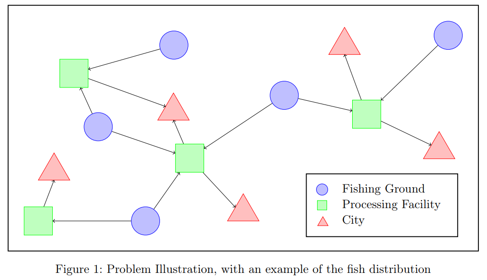

Protein deficiency and poverty in the Philippines is a an alarming issue, especially among children and pregnant women. Limited access to protein-rich food contributes to malnutrition and stunted growth, affecting health and development while also worsening poverty in the long term. To tackle this issue, citizens of the Philippines have focused on catching fish as one of the ways to provide a more affordable source of protein. However, overfishing and inefficient resource allocation have compromised the steady and reliable supply of fish—and with it, protein—while also worsening the economic security of the people. 

Thus, this project strives to create a Mixed Integer Linear Program (MILP) to address this issue. Our MILP is designed to find an optimal strategy to catch and distribute fish among the people so as to maximize the overall protein distribution while minimizing all associated costs.

The Philippines is one of the world’s biggest archipelagos: it is made up of multiple islands interconnected by sea. As such, the Philippines is blessed with abundant natural resources from the sea, namely fish. However, a major challenge is posed in that this fish is not directly accessible to the people. For an ordinary person to consume fish, fish must be distributed through an intricate supply chain involving, from the very beginning, a fishing ground, and then a processing facility, and finally a city from where a person can directly buy fish. Consider the following diagram to illustrate this supply chain.

